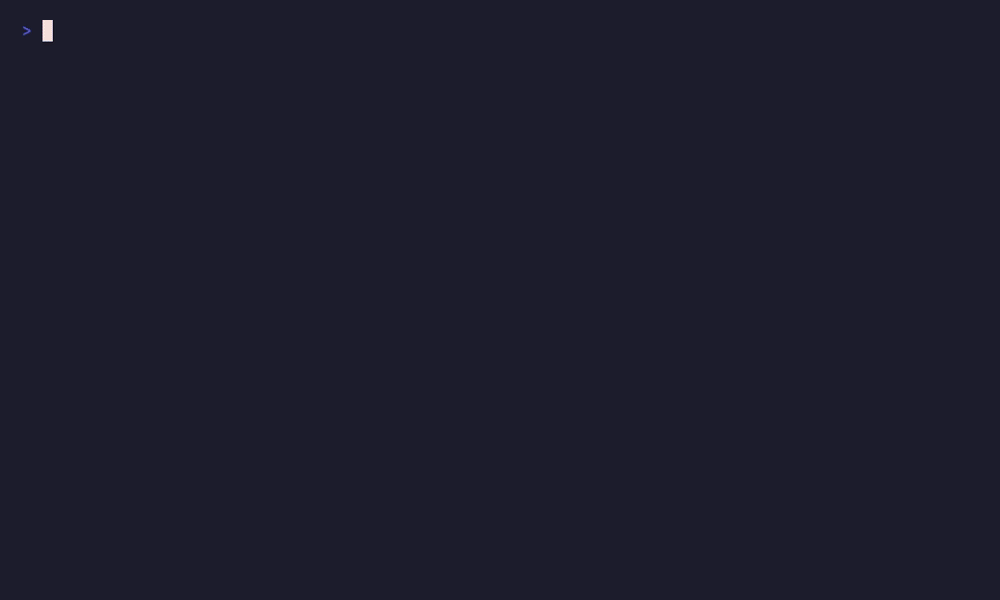

#  Engram

**Persistent memory for AI agents. In-process. No infra.**

> Give your AI agent the memory of a colleague who's worked with you for years — without cloud, API keys, or Docker.

[](https://github.com/HBarefoot/engram/actions/workflows/ci.yml)
[](https://www.npmjs.com/package/@hbarefoot/engram)
[](https://next.henrybarefoot.com/engram)
[](https://opensource.org/licenses/MIT)
[](https://nodejs.org)
[](https://modelcontextprotocol.io)
[](https://glama.ai/mcp/servers/HBarefoot/engram)

```bash
npm install -g @hbarefoot/engram
engram start
```

<p align="center"></p>

Your AI agent now has long-term memory. Two minutes, no setup, no cloud.

- 🧠 **In-process** — runs inside your agent's stack. No separate server to deploy, no IPC overhead, nothing to fork.
- 📴 **Offline** — local SQLite + bundled embeddings (~23 MB). No API keys, no data leaving your machine.
- 🔌 **MCP-native** — first-class Model Context Protocol integration with Claude Desktop, Claude Code, Cursor, Windsurf, and Cline.
- 🔐 **Safety by default** — automatic secret detection on every write. API keys, private keys, connection strings, JWTs blocked before they hit the database.

---

## Support Engram

<a id="support-engram"></a>

**Engram is free and MIT-licensed — and always will be.** No paywalls, no tier-locked features, no telemetry. Every feature ships in the open-source package. Sponsorship is purely a way to fund continued development, not to unlock anything.

[](https://buy.polar.sh/polar_cl_SJqyRrR9SLdBUQEtdUt0K5j7el8kKVC1eN0wT2S36rH)

If Engram saves you time, you can sponsor it via [Polar](https://buy.polar.sh/polar_cl_SJqyRrR9SLdBUQEtdUt0K5j7el8kKVC1eN0wT2S36rH):

| Tier | Price / month | For |
|---|---|---|
| 🌱 **[Supporter](https://buy.polar.sh/polar_cl_SJqyRrR9SLdBUQEtdUt0K5j7el8kKVC1eN0wT2S36rH)** | $5 | Individuals who want the project to keep shipping. |
| ⚡ **[Power User](https://buy.polar.sh/polar_cl_SJqyRrR9SLdBUQEtdUt0K5j7el8kKVC1eN0wT2S36rH)** | $25 | Heavy users who rely on Engram day to day. |
| 👥 **[Team](https://buy.polar.sh/polar_cl_SJqyRrR9SLdBUQEtdUt0K5j7el8kKVC1eN0wT2S36rH)** | $100 | Teams standardizing on Engram across projects. |
| 🏢 **[Enterprise](https://buy.polar.sh/polar_cl_SJqyRrR9SLdBUQEtdUt0K5j7el8kKVC1eN0wT2S36rH)** | $499 | Priority response on issues + dedicated integration help. |

**About Enterprise.** Engram is MIT-licensed, so commercial use is *already* granted — you don't need to buy a license to use it at work. The Enterprise tier buys **priority response** on issues and **dedicated help wiring Engram into your stack**. For organizations whose policy precludes depending on MIT-licensed software, an optional commercial-license override is available on request. (Engram is maintained by a solo developer, so this is best-effort priority response, not a contractual SLA.)

---

## Why Engram?

Most agent-memory products are services you run alongside your agent — Postgres, Docker, cloud accounts, API keys. Engram embeds *inside* your agent's process: a focused, stable npm package with practical guardrails.

| | **Engram** | **Lodis** | **Mem0 / OpenMemory** | **Zep** | **Letta** |
|---|---|---|---|---|---|
| **Maturity** | v1.4.x, stable | v0.5.x, early | mature / SaaS | v0.x | v0.x |
| **Infra to operate** | None (npm package) | None (npx package) | Cloud account *or* multi-container Docker | Docker + Postgres + Graphiti | Docker + Postgres |
| **Install footprint** | ~23 MB | ~22 MB | Hundreds of MB containers (self-hosted) | Hundreds of MB | Hundreds of MB |
| **Works offline** | ✅ | ✅ | ❌ Cloud / ✅ if self-hosted | ❌ External embed provider | ❌ External LLM provider |
| **MCP-native** | ✅ Primary | ✅ Primary | 🟡 OpenMemory ships an MCP server | ❌ REST/SDK | ❌ REST/SDK |
| **REST API alongside MCP** | ✅ | ❌ MCP-only | ✅ Cloud | ✅ | ✅ |
| **Surface area** | 6 tools, 5 categories | 40 tools, 14 entity types + 4 permanence tiers + temporal supersession | varies | varies | varies |
| **Automatic secret detection** | ✅ Blocks on every write | 🟡 `memory_scrub` opt-in tool | 🟡 Not first-class | 🟡 Not first-class | 🟡 Not first-class |
| **Agent auto-discovery** | ✅ Dashboard Integration Wizard | ❌ Manual config | ❌ | ❌ | ❌ |
| **Desktop app** | ✅ macOS Tauri menu bar | ❌ | ❌ | ❌ | ❌ |
| **LLM-powered extraction** | ❌ Rule-based (Layer 1 hook documented) | ❌ LLM-free read/write | ✅ Built-in | ✅ Built-in | ✅ Built-in |
| **Feedback / contradiction workflow** | ✅ Side-by-side conflict-resolution UI + feedback loop | 🟡 Programmatic correct/confirm/supersede tools | 🟡 No first-class feedback | 🟡 | 🟡 |

*Sources: [@sunriselabs/lodis](https://www.npmjs.com/package/@sunriselabs/lodis), [Sunrise-Labs-Dot-AI/engrams](https://github.com/Sunrise-Labs-Dot-AI/engrams), [mem0.ai](https://mem0.ai/), [github.com/getzep/zep](https://github.com/getzep/zep), [github.com/letta-ai/letta](https://github.com/letta-ai/letta). See [`docs/competitive-intel.md`](docs/competitive-intel.md) for the full breakdown. Where competitors lead — LLM-powered extraction in Mem0/Zep/Letta, broader feature surface in Lodis — we list it honestly. Engram's `llm.*` config block is the documented hook for opt-in LLM extraction; the default zero-config path uses rule-based extraction so the package stays offline and infra-free.*

**TL;DR — when each one fits.** Pick **Engram** if you want a focused, stable memory layer with practical guardrails (secret detection, agent auto-discovery, desktop app) and a simple 5-category mental model. Pick **Lodis** if you want a knowledge-graph-style memory with 14 entity types and temporal supersession. Pick **Mem0/Zep/Letta** if you need LLM-powered extraction and don't mind operating infrastructure for it.

---

## Quickstart

<a id="quickstart"></a>

### 1. Install

```bash
npm install -g @hbarefoot/engram
```

### 2. Start the server

```bash
engram start             # MCP + REST + Dashboard on localhost:3838
engram start --mcp-only  # MCP server only, stdio mode (for agent integration)
```

### 3. Connect your AI agent

**Claude Code:**

```bash
claude mcp add engram -- engram start --mcp-only
```

**Claude Desktop** — add to `~/Library/Application Support/Claude/claude_desktop_config.json`:

```json
{
  "mcpServers": {
    "engram": {
      "command": "engram",
      "args": ["start", "--mcp-only"]
    }
  }
}
```

**Cline / Cursor / Windsurf** — add the same `mcpServers` block to your editor's MCP config. The built-in dashboard at [http://localhost:3838](http://localhost:3838) has an **Integration Wizard** that auto-detects your installed agents and generates the config for you.

### 4. Use it

```
You:    "Remember that our API uses JWT tokens with 24-hour expiry."
Claude: (stores via engram_remember)

You:    (next day) "What authentication approach are we using?"
Claude: (recalls via engram_recall) — "JWT tokens, 24-hour expiry."
```

Memories persist across sessions, machine restarts, and even between different AI clients sharing the same Engram instance.

---

## Memory that improves over time

Most memory systems are append-only stores: write once, retrieve forever, hope for the best. Engram learns.

- **Feedback loop** (`engram_feedback`) — when an agent recalls a memory, you or the agent can vote it helpful or unhelpful. Memories accumulate a score in `[-1, 1]`; consistently-unhelpful memories see their confidence decay automatically.
- **Contradiction detection** — when two memories conflict ("prefers Fastify" vs "switched to Express"), the consolidation engine flags them. The dashboard's **Conflicts** tab shows them side-by-side with four resolution actions: keep A, keep B, keep both, or dismiss.
- **Deduplication on insert** — identical memories (≥0.95 cosine similarity) are rejected. Near-duplicates (0.92–0.95) absorb the new content into the existing record. The store stays clean without manual pruning.
- **Decay** — memories that aren't recalled lose confidence over time and stop polluting future results.

The longer you use Engram, the sharper its recall gets.

---

## MCP Tools

Engram exposes 6 tools to AI agents over stdio:

| Tool | Description |
|---|---|
| `engram_remember` | Store a memory with category, entity, confidence, namespace, tags. Auto-runs secret detection. |
| `engram_recall` | Hybrid semantic + FTS5 search. Supports `category`, `namespace`, `threshold`, and `time_filter`. |
| `engram_forget` | Delete a specific memory by ID. |
| `engram_feedback` | Vote a memory helpful/unhelpful. Drives the feedback loop above. |
| `engram_context` | Pre-formatted context block (`markdown` / `xml` / `json` / `plain`) with a token budget for system-prompt injection. |
| `engram_status` | Health check: memory count, model status, configuration. |

### Memory categories

- **fact** — Objective truths about setup, architecture, or configuration.
- **preference** — User likes, dislikes, style choices.
- **pattern** — Recurring workflows and habits.
- **decision** — Choices made and the reasoning behind them.
- **outcome** — Results of actions taken.

---

## CLI Reference

```bash
engram start                       # Start MCP + REST + dashboard
engram start --mcp-only            # MCP server only (stdio mode)
engram start --port 3838           # Custom REST port

engram remember "<content>"        # Store a memory   (-c category -e entity -n namespace --confidence)
engram recall "<query>"            # Search memories  (-l limit -c category -n namespace --threshold)
engram forget <id>                 # Delete by ID
engram list                        # List memories    (-l limit --offset -c category -n namespace)
engram status                      # Health check

engram consolidate                 # Deduplicate, detect contradictions, decay
                                   # (--no-duplicates / --no-contradictions / --no-decay / --cleanup-stale)
engram conflicts                   # List unresolved contradictions
engram export-context              # Export curated context block
                                   # (-o file -f markdown|claude|txt|json -c categories --min-confidence ...)
engram import                      # Import from local sources
                                   # (-s cursorrules|claude|package|git|ssh|shell|obsidian|env --dry-run)
```

Run `engram --help` for the full flag list.

---

## REST API

The REST API runs on `http://localhost:3838` by default.

| Method | Endpoint | Description |
|---|---|---|
| GET | `/health` | Liveness check |
| GET | `/api/status` | System status + stats |
| GET | `/api/installation-info` | Detected agents, runtime, install location |
| POST | `/api/memories` | Create a memory |
| GET | `/api/memories` | List with pagination + filters |
| POST | `/api/memories/search` | Semantic search |
| GET | `/api/memories/:id` | Read a single memory |
| DELETE | `/api/memories/:id` | Delete by ID |
| POST | `/api/memories/bulk-delete` | Bulk-delete by ID list |
| POST | `/api/consolidate` | Run consolidation pipeline |
| GET | `/api/conflicts` | Legacy tag-based conflict view |
| GET | `/api/contradictions` | Unresolved contradictions |
| POST | `/api/contradictions/:id/resolve` | Resolve (keep_first / keep_second / keep_both / dismiss) |
| GET | `/api/contradictions/count` | Unresolved count (for badge) |
| GET | `/api/analytics/overview` | Memory health dashboard data |
| GET | `/api/analytics/stale` | Memories with no recent recall |
| GET | `/api/analytics/never-recalled` | Memories never returned by any query |
| GET | `/api/analytics/duplicates` | Detected near-duplicates |
| GET | `/api/analytics/trends` | Time-series creation/recall trends |
| POST | `/api/export/static` | Export context block as a static file |
| GET | `/api/import/sources` | List importable local sources |
| POST | `/api/import/scan` | Two-phase import: preview extracted memories |
| POST | `/api/import/commit` | Two-phase import: commit selected memories |

---

## Web Dashboard

A built-in React dashboard at [http://localhost:3838](http://localhost:3838):

- **Dashboard** — Memory stats, recent activity, health gauge.
- **Memories** — Browse, filter, inline-edit, bulk-delete.
- **Search** — Semantic search with score breakdown.
- **Statistics** — Charts by category, namespace, and time.
- **Health** — Stale, never-recalled, low-feedback memories with one-click cleanup.
- **Conflicts** — Side-by-side contradiction resolution.
- **Agents** — Integration wizard that auto-detects installed AI clients and writes their MCP configs (with timestamped backups).
- **Import** — Wizard for cursorrules, .claude files, package.json, git config, SSH config, shell history, Obsidian, and .env.

---

## How it works

1. **Store**: `engram_remember` runs content through secret detection, then embeds it locally using [all-MiniLM-L6-v2](https://huggingface.co/Xenova/all-MiniLM-L6-v2) (~23 MB, CPU-only, downloaded once and cached at `~/.engram/models/`). The embedding and metadata land in SQLite at `~/.engram/memory.db`.
2. **Recall**: `engram_recall` embeds the query, fetches candidates via FTS5 + in-namespace embeddings, and scores them as `(similarity × 0.45) + (recency × 0.15) + (confidence × 0.15) + (access × 0.05) + (feedback × 0.10) + fts_boost`. Top results are returned and their access stats updated.
3. **Deduplicate**: on insert, identical memories (≥0.95 similarity) are rejected; near-duplicates (0.92–0.95) absorb new content into the existing row.
4. **Learn**: `engram_feedback` adjusts a memory's `feedback_score` and — after 5+ votes — bumps the confidence score up or down.
5. **Protect**: every write passes through pattern-based secret detection (OpenAI/Stripe/AWS/GitHub/Slack/Google keys, private keys, connection strings, JWTs, high-entropy strings). Detected secrets either reject the memory or redact the secret portion.

---

## Configuration

Engram stores everything under `~/.engram/`:

```
~/.engram/
├── memory.db          # SQLite database (memories + embeddings + FTS5 index)
├── config.json        # Server configuration
└── models/            # Cached embedding model
```

Defaults work out of the box. To customize:

```json
{
  "port": 3838,
  "dataDir": "~/.engram",
  "defaults": {
    "namespace": "default",
    "recallLimit": 5,
    "confidenceThreshold": 0.3,
    "tokenBudget": 500,
    "maxRecallResults": 20
  },
  "embedding": {
    "provider": "local",
    "model": "Xenova/all-MiniLM-L6-v2"
  },
  "consolidation": {
    "enabled": true,
    "intervalHours": 24,
    "duplicateThreshold": 0.92,
    "decayEnabled": true
  },
  "security": {
    "secretDetection": true,
    "auditLog": false
  }
}
```

The `llm.*` block powers the optional local AI enhancement below. It is **off by default**
(`llm.provider: null`); the zero-config path uses rule-based extraction and makes no LLM calls.

---

## Optional: local AI enhancement (Ollama)

Engram works fully offline with zero AI dependencies. If you want a little more accuracy and
already run a local model, you can **optionally** turn on "Layer 1" — and it stays 100% on your
machine.

- **Free, opt-in, off by default.** Nothing changes unless you enable it.
- **Local-first.** Uses your own [Ollama](https://ollama.com) (default) or any OpenAI-compatible
  local server (LM Studio, llama.cpp). No cloud, no API key, no telemetry — **your memory content
  never leaves your device.**
- **Graceful.** Every call has a timeout and falls back to the built-in rule-based path if the
  model is slow, unreachable, or returns junk. Engram never crashes because a model is down.

What it improves when enabled: sharper `category`/`entity`/`confidence` on new memories, and an
LLM confirmation step that reduces false-positive contradiction flags.

**Recommended model: `henrybarefoot1987/engram-extract`.** The layer's two jobs are *classification*, not
generation — so a small model with constrained decoding (the model is forced to emit valid JSON)
and thinking turned off is fast (sub-second), cool, and accurate. Pull it (or build it locally
from the Modelfile):

```bash
ollama pull henrybarefoot1987/engram-extract
# …or build from source:
ollama create henrybarefoot1987/engram-extract -f models/engram-extract.Modelfile
```

Then set the model to `henrybarefoot1987/engram-extract`. It's a recommendation, not a lock-in — **any** Ollama or
OpenAI-compatible model still works. See [`docs/llm/recommended-model.md`](docs/llm/recommended-model.md)
for the base model, licensing, and how to pick the smallest model that beats rules on your hardware.

**Enable it (desktop app):** Preferences → **AI Enhancement** → toggle on, pick a model, **Test
connection**, **Save**. The same tab shows a **live status badge**, **activity stats** (enhanced
vs fallback extractions, contradictions filtered, average latency), and a **recent-events list**
so you can see the layer actually working. Programmatically, `GET /api/llm/status` and
`GET /api/llm/stats` expose the same data (all local — no telemetry).

**Enable it (config file)** — `~/.engram/config.json`:

```json
{
  "llm": {
    "provider": "ollama",
    "endpoint": "http://localhost:11434",
    "model": "llama3.2:3b",
    "apiKey": null
  }
}
```

First: `ollama pull llama3.2:3b`. Set `"provider": null` to turn it back off (the default).
For an OpenAI-compatible local server, use `"provider": "openai-compatible"` and point `endpoint`
at it (e.g. `http://localhost:1234`); `apiKey` is sent only if set.

> **Privacy note:** "no memory data leaves your device" is only literally true when `endpoint` is
> **local** (localhost/127.0.0.1). If you point it at a non-local host, memory content is sent there
> for classification — the desktop AI Enhancement tab shows an explicit warning in that case. If the
> model is unreachable, a circuit breaker pauses the layer and Engram falls back to rule-based
> extraction with no added latency.

---

## Advanced usage

### Sandboxed evaluation

Redirect Engram's data directory to a throwaway location so it doesn't touch `~/.engram/memory.db`. Useful for first-time evaluators, CI runs, or testing the desktop sidecar against a fresh DB:

```bash
# Via CLI flag (highest priority)
engram start --data-dir /tmp/engram-eval

# Or via env var
ENGRAM_DATA_DIR=/tmp/engram-eval engram start

# Works on every Engram command that touches the DB:
ENGRAM_DATA_DIR=/tmp/engram-eval engram remember "test memory" -c fact
ENGRAM_DATA_DIR=/tmp/engram-eval engram recall "test"
ENGRAM_DATA_DIR=/tmp/engram-eval engram status
```

Override priority: `--data-dir` flag > `ENGRAM_DATA_DIR` env var > `dataDir` in `~/.engram/config.json` > default (`~/.engram`).

### Namespace isolation

```bash
engram remember "Uses Next.js 14 app router" -n my-saas
engram remember "WordPress multisite + Redis" -n client-site

engram recall "what framework?" -n my-saas
```

### Temporal queries

Time-range filtering is available via MCP and REST. Agents pass a `time_filter` object to `engram_recall`:

```json
{
  "query": "deployment changes",
  "time_filter": { "after": "last week" }
}
```

```json
{
  "query": "API decisions",
  "time_filter": { "after": "2026-01-01", "before": "2026-06-01" }
}
```

Supported shapes: `after` / `before` (ISO date or relative string like `"3 days ago"`), or `period` shorthand (`today`, `yesterday`, `this_week`, `last_week`, `this_month`, `last_month`, `this_year`, `last_year`).

### Export context for documentation

```bash
engram export-context -f markdown -n my-project -o PROJECT_CONTEXT.md
engram export-context -f claude -o CLAUDE.md
```

---

## Programmatic usage

Engram also works as a library inside your Node.js app:

```javascript
import {
  loadConfig,
  getDatabasePath,
  getModelsPath,
  initDatabase,
  createMemory,
  recallMemories
} from '@hbarefoot/engram';

const config = loadConfig();
const db = initDatabase(getDatabasePath(config));

createMemory(db, {
  content: 'User prefers Fastify over Express',
  category: 'preference',
  confidence: 0.9
});

const results = await recallMemories(
  db,
  'preferred web framework',
  { limit: 5 },
  getModelsPath(config)
);
```

---

## Contributing

See [CONTRIBUTING.md](CONTRIBUTING.md) for development setup, the versioning policy (npm + desktop bump together), and the release checklist. The project's licensing and sustainability stance is in [BUSINESS_MODEL.md](BUSINESS_MODEL.md) — short version: pure OSS, MIT forever, no paywalls.

```bash
git clone https://github.com/HBarefoot/engram.git
cd engram
npm install
npm run dev
```

If Engram is useful to you, here's how to help:

- ⭐ **Star the repo** — the loudest signal that this is worth continuing.
- 🐛 **Open an issue** — bug, feature request, or "we use Engram at \<company\> for \<thing\>" stories all welcome.
- 💬 **Start a [discussion](https://github.com/HBarefoot/engram/discussions)** — design questions, integration ideas, "how would I…" — all good.
- 💜 **[Support Engram](#support-engram)** — sponsor via Polar to fund continued development. No tier-locked features; sponsorship goes straight to keeping the project shipping.

---

## Feedback

Using Engram? Tell me what's working and what isn't — open a [Discussion](https://github.com/HBarefoot/engram/discussions), [file feedback](https://github.com/HBarefoot/engram/issues/new?template=feedback.yml), or run `engram feedback` from the CLI. **No telemetry, ever** — Engram never phones home, so the only feedback I get is what you choose to send.

---

## Find Engram on Glama

Engram is listed in the [Glama MCP directory](https://glama.ai/mcp/servers/HBarefoot/engram) and the [official MCP Registry](https://registry.modelcontextprotocol.io) as `io.github.HBarefoot/engram`.

<p align="center">
  <a href="https://glama.ai/mcp/servers/HBarefoot/engram">
    
  </a>
</p>

---

## License

MIT © 2026 [HBarefoot](https://github.com/HBarefoot)
